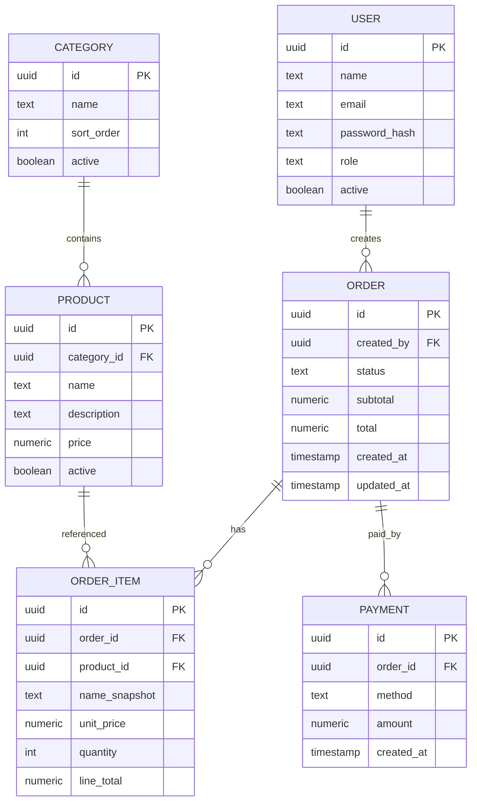

# 🍔 LanchOn – Sistema de Gestão de Lanchonete (Backend em Java)

## 📌 Descrição

O **LanchOn** é um sistema backend desenvolvido em **Java (Spring Boot)** para gerenciar as operações de uma lanchonete de forma digital e organizada.
O objetivo principal é fornecer uma **API REST** que permita o gerenciamento de **produtos, pedidos, pagamentos e relatórios de vendas**.

O sistema contempla três papéis principais de usuário:

* **Atendente/Caixa** → registra pedidos, envia para a cozinha e finaliza pagamentos.
* **Cozinha** → acompanha a fila de pedidos e atualiza o status.
* **Gerente** → gerencia catálogo, usuários e acessa relatórios.

---

## ⚙️ Tecnologias Utilizadas

* Java **21**
* Spring Boot **3**
* Spring Data JPA (Hibernate)
* Spring Security *(planejado)*
* Flyway (migrações de banco)
* PostgreSQL
* Lombok
* Maven

---

## 🚀 Como Rodar o Projeto

### 📋 Pré-requisitos

* Java **21+**
* PostgreSQL rodando localmente
* Maven **3.9+**

### ▶️ Passos

1. Clone o repositório:

   ```bash
   git clone https://github.com/seu-usuario/lanchon-backend.git
   cd lanchon-backend
   ```

2. Configure o banco de dados no arquivo `application.properties` ou via variáveis de ambiente:

   ```properties
   spring.datasource.url=jdbc:postgresql://localhost:5432/lanchon
   spring.datasource.username=postgres
   spring.datasource.password=suasenha

   spring.jpa.hibernate.ddl-auto=update
   spring.jpa.show-sql=true
   spring.jpa.properties.hibernate.dialect=org.hibernate.dialect.PostgreSQLDialect

   spring.flyway.enabled=true
   ```

3. Compile e rode o projeto:

   ```bash
   mvn spring-boot:run
   ```

4. A API estará disponível em:

   ```
   http://localhost:8080/api
   ```

---

## 📖 Endpoints da API (versão inicial)

### 🔑 Autenticação & Usuários

* `POST /auth/login` → autenticação de usuário
* `GET /me` → informações do usuário autenticado
* `POST /users` → criar usuário (**Gerente**)
* `GET /users` → listar usuários (**Gerente**)
* `PATCH /users/{id}` → atualizar usuário (**Gerente**)
* `DELETE /users/{id}` → desativar usuário (**Gerente**)

### 🛒 Catálogo

* `GET /categories` → listar categorias
* `POST /categories` → criar categoria (**Gerente**)
* `PATCH /categories/{id}` → atualizar categoria (**Gerente**)
* `DELETE /categories/{id}` → remover categoria (**Gerente**)
* `GET /products` → listar produtos
* `GET /products/{id}` → detalhar produto
* `POST /products` → criar produto (**Gerente**)
* `PATCH /products/{id}` → atualizar produto (**Gerente**)
* `DELETE /products/{id}` → remover produto (**Gerente**)

### 📦 Pedidos

* `POST /orders` → criar pedido (**Atendente**)
* `POST /orders/{id}/items` → adicionar item
* `PATCH /orders/{id}/items/{itemId}` → atualizar item
* `DELETE /orders/{id}/items/{itemId}` → remover item
* `POST /orders/{id}/submit` → enviar pedido à cozinha
* `POST /orders/{id}/cancel` → cancelar pedido
* `GET /orders` → listar pedidos (com filtros)
* `GET /orders/{id}` → detalhar pedido

### 👨‍🍳 Cozinha

* `GET /kitchen/queue` → listar pedidos pendentes/prontos
* `POST /orders/{id}/ready` → marcar pedido como pronto

### 💳 Pagamentos

* `POST /orders/{id}/pay` → registrar pagamento

### 📊 Relatórios

* `GET /reports/sales/summary?date=YYYY-MM-DD` → resumo de vendas do dia

### ❤️ Saúde do Sistema

* `GET /health` → checagem do sistema

---

## 🗂️ Modelo Entidade-Relacionamento (simplificado)



---

## 📌 Próximos Passos

* [ ] Implementar autenticação com **JWT**
* [ ] Criar testes unitários e de integração
* [ ] Adicionar documentação da API com **Swagger**
* [ ] Configurar **CI/CD**

---

## 👨‍💻 Autor

Projeto desenvolvido por **Leandro de Oliveira Leite** no contexto da disciplina **Sistemas Corporativos - UFPB**.


Quer que eu crie também uma **versão com tabela de rotas/endpoints** (mais organizada para consulta rápida)?
